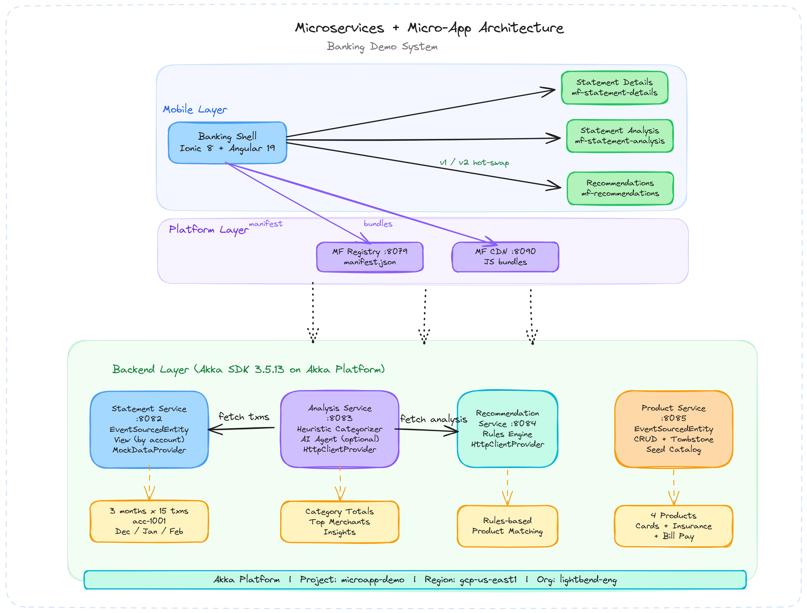

# Microservices + Micro-App Banking Demo

A full demo system showcasing microservices on **Akka SDK (Java 21)** with a mobile banking app built on **Angular 19 + Ionic 8**, delivering independently-updatable micro-app UIs. It's the running prototype for an Islamic-banking "next-gen app" — a complete customer journey assembled from a handful of Akka building blocks (event-sourced entities, workflows, an AI agent) behind config-driven micro-frontends.

## The demo journey ("Sara's Day")

A prospective customer goes from stranger → engaged customer, entirely in the app:

1. **Pre-login** — cold open shows a landing page (no account yet).
2. **Register** → an instant **personalized welcome offer**; stubbed eKYC → full customer. *(customer-service — one event-sourced id evolves VISITOR→REGISTERED→CUSTOMER)*
3. **Onboard** — open a **CASA** account; abandon mid-flow, reopen → it **resumes exactly where you left off**; then add **Takaful** via a distinct journey. *(onboarding-service — resumable Akka Workflows)*
4. **In the app — Home** — month In/Out, **Tabungs** (savings goals) with progress bars + quick contribute, and a **"moment for you"** offer card that fires when she taps a large transaction (overseas charge → multi-currency; airline charge → travel takaful). *(goals-service — Tabung ESE + view; recommendation-service — in-session NBA evaluator)*
5. **In the app — more** — statements, spending analysis, product tips.
6. **AI wealth advisor ⭐** — ask *"can I afford to save for a holiday in 2 years?"*; the agent uses real account data, reasons, and proposes a goal with a human handoff. *(advisor-service — Akka Agent + function tools, OpenAI)*
7. **Config-driven UI** — micro-apps swap live (e.g. Statement Analysis v1→v2) by changing a manifest — no rebuild, no app-store release.

## Architecture




## Prerequisites

- **Java 21** (Eclipse Adoptium recommended)
- **Apache Maven 3.9+**
- **Node.js 20+** and npm
- **curl** (for testing)
- Akka SDK repository access (configured in `~/.m2/settings.xml`)
- *(optional)* `OPENAI_API_KEY` — for live AI wealth-advisor answers (everything else runs fully offline)
- *(optional)* the [Akka CLI](https://doc.akka.io/reference/cli/installation.html) — for `akka local console` and cloud deploy

## Quick Start

> Full local runbook (manual service-by-service flow + troubleshooting): **[docs/RUNNING-LOCALLY.md](docs/RUNNING-LOCALLY.md)**.

### Option A — Demo Console (one command)

```bash
./scripts/demo-console.sh        # opens http://localhost:9700
```

A small operator console: click **▶ Start everything** to launch all services **and** the UI (≈1–2 min — watch the progress bar), **Seed / reset data**, flip the Statement Analysis micro-app **v1 ⇄ v2** live, and watch service health. Then open the banking app at **http://localhost:4200**.

### Option B — scripts

```bash
./scripts/run-local.sh                                 # all services, started in order + seeded
cd mobile/banking-shell && npm install && npm start    # UI on http://localhost:4200
```

### Stop everything

```bash
./scripts/stop-local.sh
```

> **OpenAI key (optional):** `export OPENAI_API_KEY=sk-...` before starting for real wealth-advisor answers; without it the advisor gives a graceful "talk to a human" fallback.

### Rebuilding micro-apps (only if you change their code)

Bundles are pre-built and served by platform-service. To rebuild + republish:

```bash
./scripts/build-microapps.sh      # ng build each micro-app
./scripts/publish-microapps.sh    # copy bundles into platform-service
```

## Service Ports

| Service | Port | Description |
|---------|------|-------------|
| statement-service | 8082 | Mock statements & transactions |
| analysis-service | 8083 | AI agent transaction analysis |
| recommendation-service | 8084 | Rules-based product recommendations |
| product-service | 8085 | Mock product catalog |
| advisor-service | 8086 | AI wealth advisor — conversational agent (OpenAI) |
| onboarding-service | 8087 | Resumable CASA + Takaful onboarding workflows |
| customer-service | 8088 | Customer lifecycle (visitor→registered→customer) + welcome offer |
| goals-service | 8089 | Savings goals (tabung) — create, contribute, track progress |
| platform-service | 8079 | Micro-frontend manifest + bundle server |
| mobile banking-shell | 4200 | Ionic Angular host app |

## API Endpoints

```bash
# Statements
curl http://localhost:8082/accounts/acc-1001/statements
curl http://localhost:8082/accounts/acc-1001/statements/stmt-2025-12

# Analysis
curl -X POST "http://localhost:8083/accounts/acc-1001/analysis/run?statementId=stmt-2025-12"
curl "http://localhost:8083/accounts/acc-1001/analysis/summary?statementId=stmt-2025-12"

# Products
curl http://localhost:8085/products

# Recommendations
curl "http://localhost:8084/accounts/acc-1001/recommendations?statementId=stmt-2025-12"

# Wealth advisor (conversational agent — needs OPENAI_API_KEY)
curl -X POST http://localhost:8086/advisor/acc-1001/ask \
  -H 'Content-Type: application/json' \
  -d '{"message":"Can I afford to save for a holiday in 2 years?"}'

# Onboarding (resumable CASA + Takaful) — applicationId is yours to choose
curl -X POST http://localhost:8087/onboarding/casa/app-123/start -H 'Content-Type: application/json' -d '{"customerId":"acc-1001"}'
curl http://localhost:8087/onboarding/casa/app-123/status   # in-progress; resume by submitting the current step
curl http://localhost:8087/onboarding/takaful/plans

# Customer lifecycle (visitor → registered → customer) — same id evolves
curl -X POST http://localhost:8088/customers/visitor-1/visitor -H 'Content-Type: application/json' -d '{"channel":"MOBILE"}'
curl -X POST http://localhost:8088/customers/visitor-1/register -H 'Content-Type: application/json' -d '{"email":"sara@example.my","phone":"0123456789","channel":"MOBILE"}'
curl -X POST http://localhost:8088/customers/visitor-1/kyc -H 'Content-Type: application/json' -d '{"idType":"NRIC","idNumber":"900101-01-1234","consent":true}'
curl http://localhost:8088/customers/visitor-1
curl http://localhost:8088/customers/prelogin

# Savings goals (tabung) — create, contribute, list
curl -X POST http://localhost:8089/customers/acc-1001/goals \
  -H 'Content-Type: application/json' \
  -d '{"name":"Hajj 2028","category":"HAJJ","targetAmount":10000,"targetDate":"2028-06-01"}'
curl http://localhost:8089/customers/acc-1001/goals          # all goals
curl http://localhost:8089/customers/acc-1001/goals/active   # active only
curl -X POST http://localhost:8089/goals/<goalId>/contribute -H 'Content-Type: application/json' -d '{"amount":250}'

# NBA — in-session "moment for you" evaluator (fires when the user taps a large txn)
curl -X POST http://localhost:8084/accounts/acc-1001/nba/evaluate \
  -H 'Content-Type: application/json' \
  -d '{"trigger":"LARGE_TRANSACTION_VIEWED","amount":850,"merchant":"Air Asia","category":"Travel","overseas":false}'

# Manifest
curl http://localhost:8079/microfrontends/manifest/demo
```

## Key Demo: Micro-App Live Update (v1 → v2)

The Statement Analysis micro-app ships in two versions, both already published to platform-service. Switch between them **without rebuilding or restarting anything** — it's a manifest change:

- **Easiest:** in the Demo Console (`./scripts/demo-console.sh`), use the **Statement Analysis — live version** toggle (**v1 ⇄ v2**).
- **Or via the manifest API** (bump `statement-analysis` to `2.0.0` in the `demo` channel):
  ```bash
  curl http://localhost:8079/microfrontends/manifest/demo            # inspect current versions
  curl -X PUT http://localhost:8079/microfrontends/manifest/demo \
    -H 'Content-Type: application/json' -d '<manifest with statement-analysis at 2.0.0>'
  ```

Then **hard-refresh the browser** (a custom element can't be redefined in an already-loaded page): the Analysis tab gains a **Top Merchants** section + a **"V2"** badge — and the **backend was never touched**. That's the "change the UI at the speed of business" proof.

## Agentic AI

Two services use the **Akka Agent** construct with `@FunctionTool` methods:

- **advisor-service** (the headline) — `WealthAdvisorAgent`: a conversational, Shariah-aware advisor that grounds answers in the customer's real data via tools (`getAccountSummary`, `getSpendingProfile`, `projectAffordability`, `listProducts`, `requestHumanHandoff`), proposes exactly one action, and defers money-movement to a human. Needs `OPENAI_API_KEY`.
- **analysis-service** — `TransactionAnalysisAgent`: spending categorizer. Default mode **heuristic** (deterministic, no LLM); set `ANALYSIS_MODE=agent` + `OPENAI_API_KEY` for the agent path.

## Project Structure

```
backend/
  statement-service/      mock statements & transactions (ESE + View)
  product-service/        product catalog (ESE + View)
  analysis-service/       spending analysis (Agent + heuristic categorizer)
  recommendation-service/ rule-based recommendations
  advisor-service/        K1 — conversational wealth advisor (Agent + function tools)
  onboarding-service/     K2 — resumable CASA + Takaful onboarding (Workflows)
  customer-service/       K3 — customer lifecycle (ESE) + welcome offer
  goals-service/          K4 — tabung savings goals (ESE + view)
platform/
  platform-service/       micro-frontend manifest (ESE) + JS bundle server
mobile/
  banking-shell/          Ionic/Angular host (pre-login gate + tabbed app, phone device frame)
  microapps/              web-component micro-apps (Angular Elements):
    prelogin/                 K3 — pre-login + register + welcome offer
    onboarding/               K2 — CASA/Takaful resumable wizard
    advisor/                  K1 — chat with the wealth advisor
    home/                     K4 — in-app home: tabungs + NBA moment-of-need card
    statement-details/        statements list
    statement-analysis/       spending analysis (v1 + v2)
    recommendations/          product tips
scripts/
  run-local.sh            start all services (background, seeded)
  stop-local.sh           stop all services + the UI
  smoke-local.sh          seed + curl every endpoint (PASS/FAIL)
  demo-console.sh         operator Demo Console (start/stop/seed/version-toggle/health)
  build-microapps.sh      build micro-app bundles
  publish-microapps.sh    publish bundles into platform-service
  warp/                   Warp launch configuration (one pane per service)
docs/
  RUNNING-LOCALLY.md      full local run + demo runbook
```

> Note: the older `run-all.sh` / `stop-all.sh` scripts are stale (they reference removed services) — use `run-local.sh` / `stop-local.sh` or the Demo Console.

## Troubleshooting

- **Port already in use**: run `./scripts/stop-local.sh` first, or check with `lsof -i :PORT`
- **Service won't start**: check `logs/<service>.log` for errors
- **Maven auth errors**: ensure the Akka SDK repo is configured in `~/.m2/settings.xml`
- **Fresh build**: `./scripts/run-local.sh --clean`
- **Advisor replies "talk to a human"**: set `OPENAI_API_KEY` before starting advisor-service
- **Resume demo (onboarding / pre-login)**: "abandon" means closing/refreshing the *app*, not restarting the service — the local dev journal is in-memory, so a service restart wipes in-progress applications/visitors
